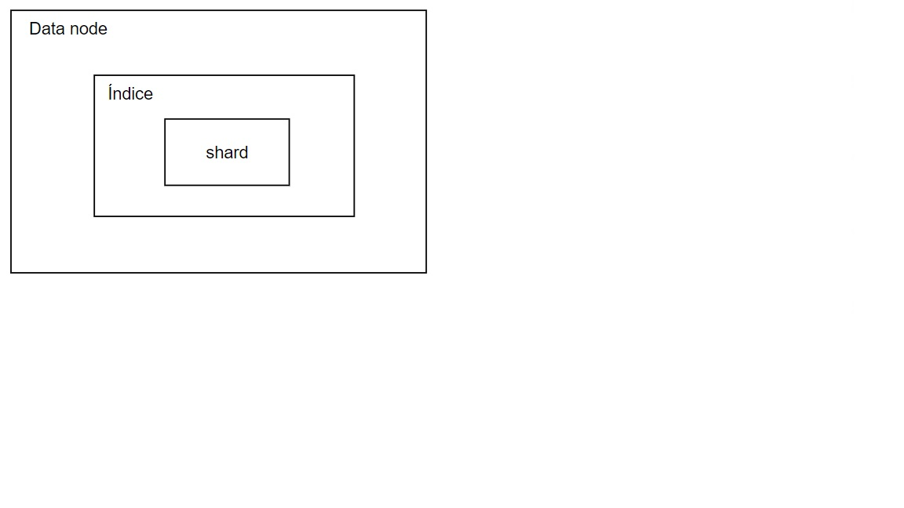
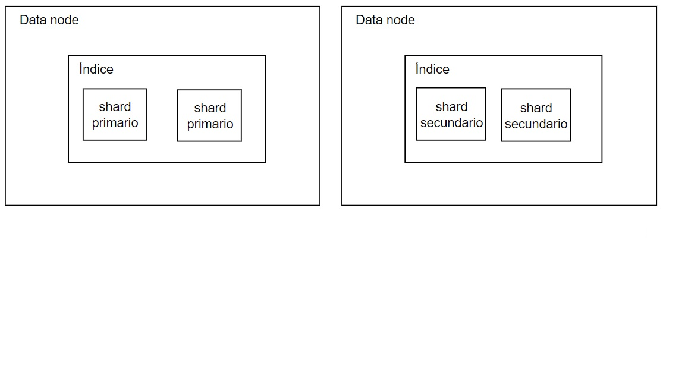
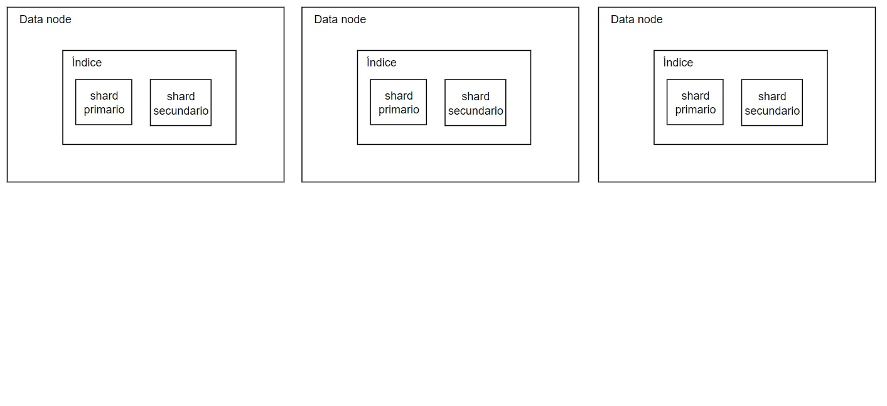
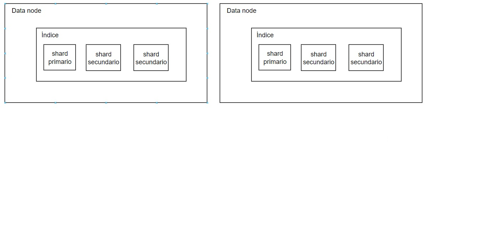
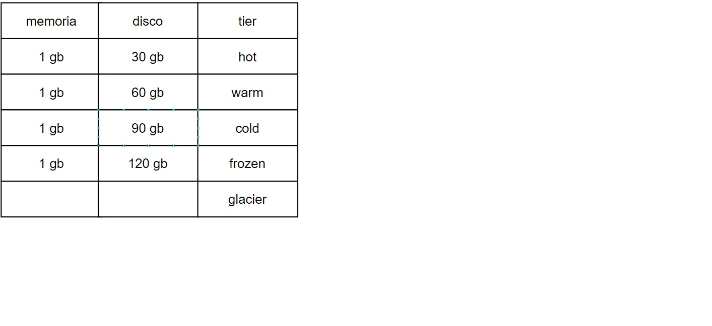

### Apuntes

Master: Coordinador, revisa la salud del cluster.  
Data: CRUD, create primitivo (insertar sin transformar los datos).  
Ingest: tiene pipelines de transformación, los datos se transforman y el data node los guarda.  
El master solo tiene los suficientes recursos para coordinar y revisar la salud.  
Si el master hace un insert y no tiene recursos para preguntar por la salud, se reporta como si el cluster estuviera caído.  
Si un data node tiene un solo shard, el data node tiene single point of failure y también puede causar cuello de botella.  

Si se tienen dos data nodes, uno con shard primario y otro con shard secundario, se aumenta la capacidad de lectura del sistema, pero la escritura sigue igual porque el primario hace las escrituras.  
Si en los dos data nodes, tienen 2 shards, los datos se dividen en dos porciones.  

Sigue habiendo el mismo problema de single point of failure ya que los primary siguen en 1 data node y todas las escrituras van a un data node.
Repartiendo los shards primarios en los data nodes, permite que las escrituras se dividan en cada data node, mejorando el rendimiento.  
Los shards secundarios también se reparten entre los data nodes, aumentando el rendimiento de lectura.  
Muchos shards pueden causar que un select ocupe muchos recursos y coordinación.  

Aumenta la capacidad metiendo más hardware, lo que causa que haya menos trabajo de escritura y lectura en los nodos.  
Si se agrega un data node sin shards, el master hace un shard allocation. Como hay 3 shards primarios para 4 data nodes, uno no hace nada de escrituras.  
Si hay pocas escrituras, pero muchas lecturas, se necesita más shards secundarios.  

Esto no funciona ya que se está usando el mismo hardware. Si se agregan dos data nodes con 1 shard secundario, puede perder consistencia ya que los shards primarios ocupan escribir a los otros shards.  
Los datos siguen un patrón de tiempo en el cual entre más cerca esté de la hora actual, más relevante es.  

Un sistema distribuido tiene nodos iguales en recursos porque al indexarlos, los datos pueden ir en cualquier nodo.  
Los datos se mueven en los tiers conforme pasa el tiempo.  
Content -> datos con altas lecturas y escrituras.  
Hot -> muchas lecturas, moderadas escrituras.  
Warm -> moderadas lecturas, pocas escrituras.  
Cold -> lecturas esporádicas, no hay.  
Frozen -> tiene un object storage que permite hacer get, put, post y delete.  