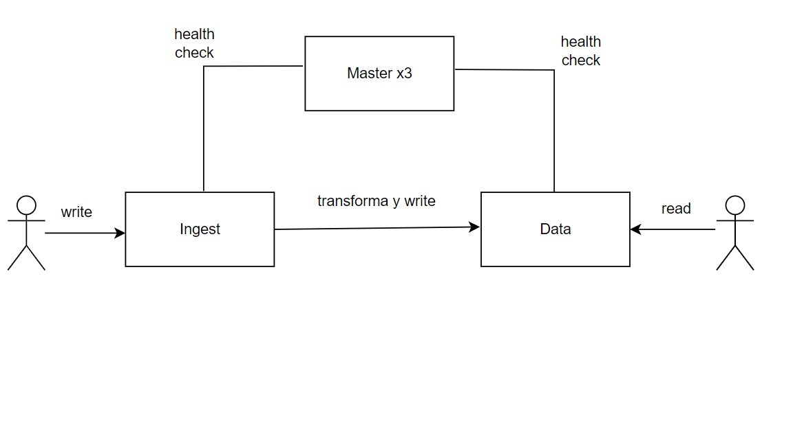

### Apuntes

LAN -> Local Area Network  
Una red tiene velocidad, que es la rapidez de pasar los bits de una computadora a otra.  
Esta rapidez es afectada por el largo del cable, agregando delay. Si las computadoras se encuentran juntas, no hay delay.  
La LAN desprecia el delay porque esto no le afecta ya que la red es corta. Funciona a velocidad cable, es decir, transfiere los datos que pueda el cable.  
La red tiene una ubicación que se le llama Region.  
Pérdida de paquetes -> se da cuando una red manda bits en cable y si algo afecta a la red, también afecta a los bits, por lo que ocupa mandar otra vez los bits hasta mandar los correctos.  
Datacenter -> crea una ubicación para servidores con estándares establecidos.  

Hacer análisis de riesgo para el datacenter para un SLA alto.  
Si se hacen varios datacenters, puede no haber sincronización de información, por lo que puede perder información.  

Se suelen usar varios Availability Zone para poder escoger el master si se pierde el master actual.  
El Region no sirve si se encuentran muy lejos, por lo que se replican los datos entre regiones.  
Azure y AWS establecen edge endpoint -> intentan llegar cerca de la zona y el internet se usa cuando este no puede llegar más cerca.  
Nunca hay que insertar los datos cuando se acaba la replicación -> ocupa verificar tipos, integridad referencial, llaves únicas, duplicidad, implementar reglas de normalización -> esto toma mucho tiempo.  
Las escrituras se encuentran en un buffer que si se va la electricidad, se pierden los datos.  
Usando logs de transacciones, se soluciona este problema.  
Consistencia eventual -> asegura los datos en la base de datos, pero no en tiempo real.  

Entre más masters haya, se ocupa más coordinación. Ocupa una consistencia fuerte.  
Elasticsearch define pipelines de transformación. Estos agarran los datos, los transforman y los guardan.  
Tiene roles:
* Master: mínimo 3 nodos
* Data (shards): guarda datos
* Ingest: recibe datos  

Routing -> pregunta al master por la ubicación del dato y el data node sabe en cual shard está el dato.  
Shard relocation -> los shards primarios solo reciben escrituras, por lo que la cantidad de shards primarios debe ser igual a la cantidad de replicas, sino se genera un cuello de botella, por lo que se asigna un shard primario en cada data node para que cada uno pueda realizar escrituras.  