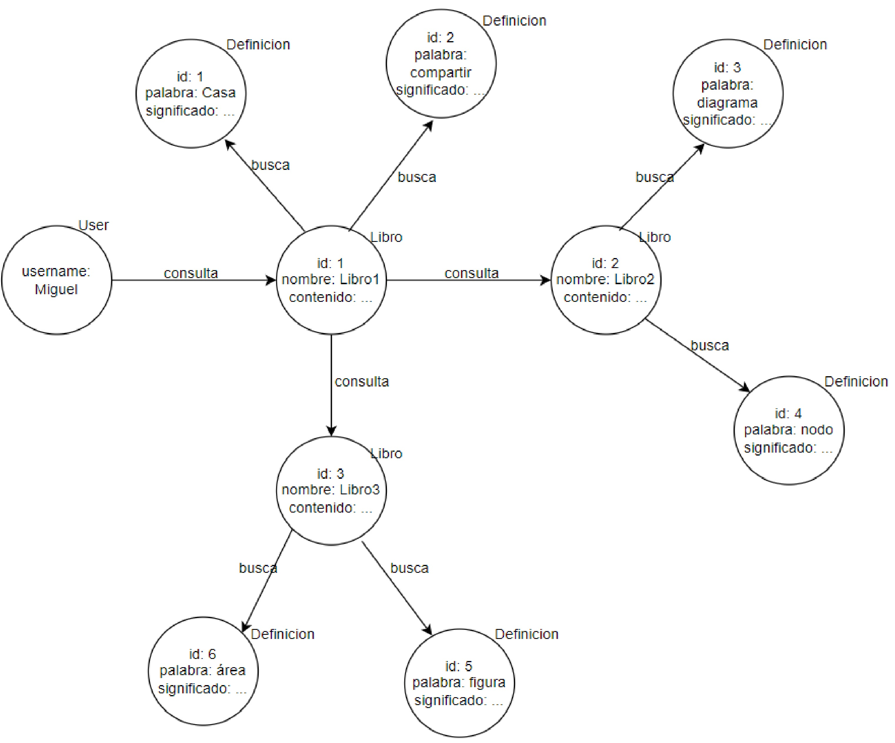
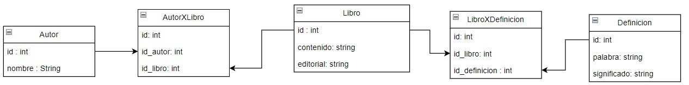

> Bases de Datos 2, Examen 
> Miguel Ku Liang - 2019061913

# 1.

## 1.

Utilizaría una base de datos de grafos, como por ejemplo Neo4j, ya que permite guardar las relaciones como relaciones, evitando problemas cuando se agregan tablas a la base de datos. Solo se ocupan los atributos que la base necesite para la relación.

## 2.

Utilizaría MongoDB. 

### a.

Por medio de Atlas Search, podemos realizar full-text search sobre los datos. Adempas, los índices son sincronizados automáticamente en la base de datos. Tiene analizadores para más de 30 lenguajes, y puede realizar fuzzy search, autocompletar y realizar facets y filtros, entre otras características.

### b.

El sharding de MongoDB permite escalar la base de datos sin afectar la aplicación. Con el shard key, podemos definir cómo va a ser distribuido los datos sobre los shards sin generar problemas de rendimiento.

### c.

## 3.

Con Neo4j, podremos movernos sobre las relaciones que se definieron para poder consultar los libros que se encuentran conectados entre ellos por las relaciones. Estas conexiones también se presentan con libros y definiciones, de manera que se pueda navegar sobre las definiciones de palabras que se presentan en el libro. La información de los libros y las definiciones se obtienen a partir de MongoDB.

## 4.

Creando replicas, podemos asegurar que si una deja de funcionar, otra puede tomar su posición para que el sistema no deje de funcionar.

## 5.

Creando índices sobre los campos adecuados. Para ello, es importante saber cuales consultas son las que más se realizan para poder determinar estos campos.

## 6.

Usando el cache, podemos guardar los resultados de consultas recientes que se realizaron para que si esta consulta se realiza de nuevo, solo se necesitará revisar el cache para devolver el resultado sin realizar algún procesamiento. Con la localidad, podemos reducir el delay que tienen los datos. Esto se genera por el viaje que tienen que realizar los datos, por lo que una localidad adecuada, permite reducir el tiempo de respuesta ya que habrá menos distancia que los datos tendrán que moverse.

# 2.

## 1.

Definiría un expression index para los tres queries que son más usuales y problemáticos para que no se tengan que procesar varias veces. Para el sistema, definiría un inverted index ya que este índice nos permitirá tener búsquedas más rápidas.

## 2.

Recomendaría MongoDB. Por medio del sharding, MongoDB permite un scale out de la aplicación con always-on availability. Además, están diseñados para ser resilientes. Se puede agregar y quitar shards en cualquier momento, y con el shard key, podemos distribuir los datos sobre los shards sin problemas.

## 3.

Creando tablas temporales podemos almacenar el resultado de la consulta y así en las próximas consultas no se necesite realizar el procesamiento, sino que se consulta esta tabla temporal.

# 3.

Hay que hacer un bypass internet para hacer replicación, tiene que tener conexiones redundantes en caso de un fallo, garantías con discos ISCSI, hardware availability, service packs, upgrade patches, firewalls en cada componente, Intrusion Detection System para identificar sucesos fuera de lo normal, Principle of Least Privileges para dar los privilegios mínimos necesarios que un usuario necesita para realizar su trabajo, federated users para monitorear la actividad de los usuarios en la base de datos, deshabilitar componenetes para evitar daños, audit y security logs para la observabilidad, encriptar los datos y administrar usuarios en la base de datos por roles.

# 4.

## 1.

Las bases de datos de series de tiempo nos muestra cómo se comportan los datos en un determinado tiempo. Este tiempo que brinda la base de datos permite que la observabilidad logre definir y mostrar el comportamiento que tuvo la base de datos en ese momento. De esta manera, podemos observer el rendimiento que ha tenido la base de datos.

## 2.

No, ya que BigTable se centra en manejar y almacenar grandes cantidades de datos, por lo que no se podría utilizar BigTable como una base de datos de series de tiempo debido a que su objetivo es distinto.

## 3.

Podemos almacenar esta información en un cold o frozen data tier. De esta manera, no se necesitará mucho hardware para los datos que serán almacenados en estos data tiers.

## 4.

* Ventajas: se puede configurar específicamente a lo que uno ocupa, tiene el control total del servicio ya que no está involucrado un tercero.
* Desventajas: se requiere conocimiento para poder configurar el servicio, se necesita realizar un mantenimiento del servicio ya que no hay un tercero que realice estas acciones.