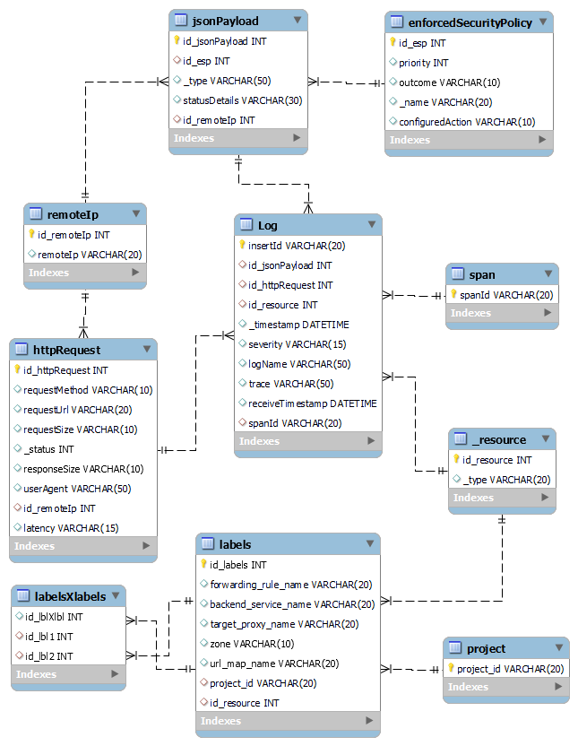

> Bases de Datos 2, Prueba corta 7 y 8  
> Miguel Ku Liang - 2019061913

# 1.

# 2.

Recomendaría MongoDB ya que además de la replicación y alta disponibilidad que ofrece, utiliza documentos BSON. Estos documentos permiten un acceso más rápido de los datos comparado a un JSON. También, puede almacenar registros con campos diferentes en una misma colección, lo que evita realizar procesamientos, como modificar el esquema, para almacenar estos registros.